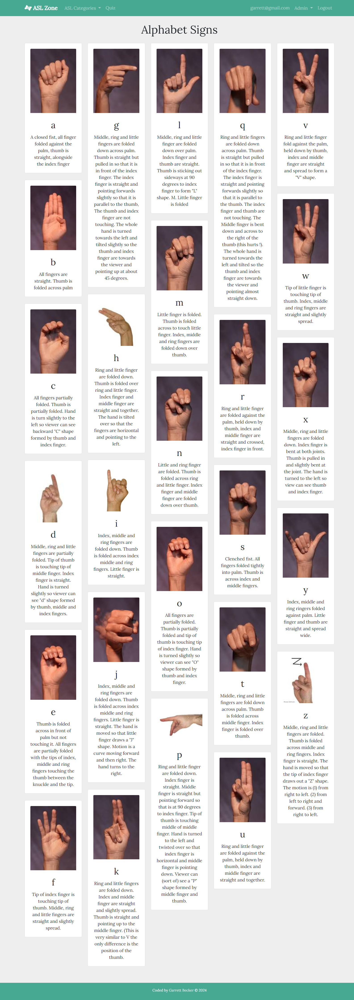
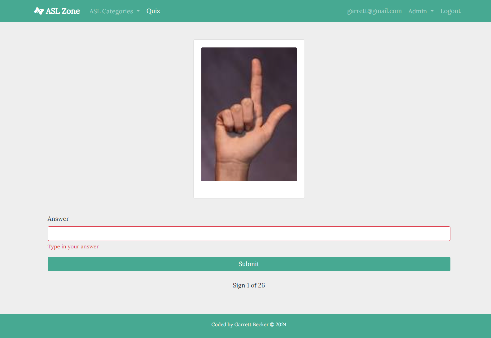

# ASL Zone Angular App

I've been getting used to building with React.js and Next.js and while I love using these, I wanted to give other frameworks like Angular a go. After finishing Brad Traversy's [Angular Front to Back course on Udemy](https://www.udemy.com/course/angular-4-front-to-back/), I wanted to try making my own app from what I learned, so I landed on this idea to make an ASL learning app where you could make an account to view signs across different categories, study, and take quizzes for each sign category to test your knowledge. Between growing up in the disabilities world because my younger sister is in a wheelchair, and watching CODA on Apple TV not long ago, I've been long interested in learning ASL and being able to communicate this way because it's such a cool way to care and love on the deaf community with the language that speaks to them. This felt like an awesome opportunity to build with more vision in mind beyond just learning a new frontend framework, and I wanted to make it easy for anyone to learn ASL and care for the deaf.

ASL Zone allows anyone wanting to learn ASL to register and login into their account (with either real/fake emails), check out different signs categories and study, take quizzes for each category, and view their user details page for current quiz scores. If you are an admin you'll be able to add/edit/delete all signs and categories from Firebase through their respective pages, as well as control if new account registration is possible on the settings page.

## Table of contents

- [Overview](#overview)
  - [Alphabet Signs Page](#alphabet-signs-page)
  - [Quiz Page](#quiz-page)
  - [Links](#links)
- [My process](#my-process)
  - [Built with](#built-with)
  - [What I learned](#what-i-learned)
  - [Continued development](#continued-development)
  - [Useful resources](#useful-resources)
- [Author](#author)

## Overview

### Alphabet Signs Page



### Quiz Page



### Links

- [Live Site URL](https://angularaslzone.web.app/login)

## My process

### Built with

- [Angular](https://angular.io/) - frontend framework
- Typescript
- HTML5
- CSS
- Bootstrap
- Mobile-first workflow
- [VS Code](https://code.visualstudio.com)

### What I learned

While similar in concept to React.js and Next.js if you're thinking of building the frontend with components, I'm sure anyone who's worked with Angular would say it has all of its own things to get used to - the biggest challenge for me working on this project were Observables. They're like Promises but not quite, and I will need to work on more projects with these to understand them. But the biggest problem to solve was figuring out subscribing to an array of Observables but needing to connect to another nested collection, because I organized the signs in Firebase to sit in their own collection with each sign's category pointing to the category collection. Each quiz score operated the same way so I knew once I figured this out I could apply the same logic there. This took a lot of persevering and connecting different parts of the solution together I found from different questions on Stack Overflow, and it felt super satisfying figuring it out!

I got more comfortable with Firebase user authentication within Angular and guarding routes as needed. I added admin functionality and realized I couldn't add more than one guard for a route at a time, so building my own custom guard to test for authentication and admin status fixed it. This was a great challenge to add in all of the CRUD functionality for signs and categories for the admin account, and it feels great having this in there so you won't need to touch Firebase itself at all. I wanted to think about practicality and how an actual app like this would be used in the wild.

Here are a few code samples from this project:

```ts
// Function in sign.service.ts to filter signs by a connecting Firebase collection
getSignsByCategory(category: string): Observable<Sign[]> {
    this.signs = this.signCollection.snapshotChanges().pipe(
      map((changes) => {
        return changes.map((action) => {
          const data = action.payload.doc.data() as Sign;
          data.id = action.payload.doc.id;
          return data;
        });
      }),
      map((signs) => {
        return signs.filter((sign) => sign.category.id === category.toLowerCase());
      }),
    );

    return this.signs;
  }
```

```ts
// Pulling only animals ASL signs from Firebase
ngOnInit() {
    this.signService.getSignsByCategory('Animals').subscribe(signs => {
      signs.forEach(sign => {
        this.categoryService.getCategory(sign.category.id).subscribe(category => {
          sign.category = category;
        });
      });
      this.signs = signs;
    });
  }
```

```html
<!-- Animals ASL signs component page -->
<div class="container">
  <div class="row justify-content-center">
    <h1 class="mb-4">Animals Signs</h1>
  </div>
  <div class="row justify-content-center">
    <div class="card-columns mb-3 justify-content-center">
      <div
        *ngFor="let sign of signs"
        class="card mb-4"
        style="max-width: 18rem"
      >
        <div class="card-body">
          
          <h2 class="card-title text-center">{{ sign.label }}</h2>
          <p class="card-text text-center">{{ sign.description }}</p>
        </div>
      </div>
    </div>
  </div>
</div>
```

### Continued development

As a starter developer, I want to keep discovering different tools and finding different ways of building, because one stack might be better for a situation than another. For a while I was getting used to React.js and Next.js, so I wanted to try building an entire Angular app on my own to make myself uncomfortable and be able to learn through challenges that arise. Working on this project gives me confidence to keep doing this!

### Useful resources

- [Stack Overflow](https://stackoverflow.com/) - Stack Overflow was a lifesaver for this project especially when figuring out intricacies with those Angular Observables and grabbing data from Firebase. Finding different answers that contributed to different parts of the challenges I had helped me piece together what I needed.

## Author

- Website - [Garrett Becker]()
- LinkedIn - [Garrett Becker](https://www.linkedin.com/in/garrett-becker-923b4a106/)
